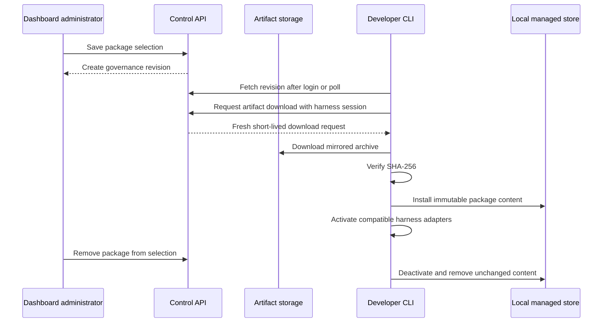

Managed packages let an administrator choose extensions in the dashboard and have each developer's CLI install the compatible contents locally. Removing a package from governance removes its activation on the next reconciliation.

## Manage packages in the dashboard

You must have the `admin` role to see **Extensions** in the dashboard sidebar.

<Steps>
  <Step title="Open Extensions">Open `http://127.0.0.1:3000/extensions` in the Compose deployment, or select **Extensions** in the administrator sidebar.</Step>
  <Step title="Choose extensions">Select catalog packages containing the skills, hooks, subagents, plugins, or helper binaries your organization approves.</Step>
  <Step title="Review executable content">Cards identify packages that contain hooks, plugins, or helpers. Selecting one authorizes that executable content for noninteractive client reconciliation.</Step>
  <Step title="Choose an audience">Keep **Everyone** to deploy across the organization, or select **Specific members** and choose one or more active administrators or members.</Step>
  <Step title="Configure overrides">Optionally disable a package for an individual harness or merge harness-specific settings into its organization defaults.</Step>
  <Step title="Publish extension changes">Publishing validates the complete selection and creates a new immutable governance revision.</Step>
</Steps>

If the page reports that no curated catalog is configured, add `package_catalog.packages` to the deployment's `blue.yaml`. You can still select **Add extension** to add a custom digest-pinned package.

## Deploy to specific members

Open an extension's details and choose **Specific members** under **Deployment audience**. Search by email and select every person who should receive the complete package bundle. Audience choices are independent per extension, so one revision can deploy different packages to different groups of people. MCP servers remain organization-wide.

Targeting uses the workspace user's stable identity. Suspended and removed users cannot authenticate, but their existing assignments are retained and resume if access is restored. Inactive assignments remain visible to administrators and can be removed; inactive users cannot be newly selected.

The Control API removes untargeted packages and their harness overrides before returning governance configuration. Changing an audience creates a new revision, so the normal client reconciliation deactivates a package when a user is removed from its audience. Mirrored private artifacts are also available only when the current package audience includes the requesting user. Public source URLs remain subject to their host's access controls.

## Add a custom package

Use the **Add extension** form when an extension is not in the curated catalog:

1. Enter a stable package ID, display name, and version.
2. Choose a managed GitHub/Bitbucket connection and enter `namespace/repository` plus a ref, or inspect a public GitHub repository or HTTPS archive. Managed repositories may be private; credentials remain in the control plane. The form records the source and computed SHA-256, and mirrors managed repository artifacts.
3. For each supported harness, choose a component type and enter its path relative to the archive root. Add separate mappings for skills, subagents, hooks, plugin directories, plugin modules, and platform-specific helper binaries.
   Set **Harness available from** and **Harness available before** when the package supports only part of that harness's release history. Use layout intervals only when paths or component types change inside that availability range.
4. Review the capability table, then select **Add to pending changes**.
5. Review the extension inventory. It shows the package, harness, enabled state, capability type, archive path, and expected managed local location.
6. Select **Publish extension changes** to create a governance revision.

The form adds the package to the pending selection first; it does not publish anything until you publish the complete selection.

To change a custom package later, open its **Edit** dialog. The **Harness version availability** section lets you update the inclusive **available from** and exclusive **available before** bounds for every selected harness. Curated catalog package ranges remain controlled by the deployment's `blue.yaml`.

## Add an extension from a public repository or archive

Public GitHub repositories do not require a managed repository connection. In the **Public repository or archive** tab, enter one of these source forms:

- `github:owner/repository@ref` for a public GitHub repository. The ref may be a branch, tag, or full commit SHA. Blue resolves it to an immutable commit and records the corresponding GitHub codeload URL.
- An immutable public HTTPS `.tar.gz` URL. Blue uses the URL as supplied and does not resolve a branch or tag encoded in it. The URL must return the archive itself: Blue does not follow redirects.

Do not enter a repository webpage such as `https://github.com/owner/repository`; it returns HTML rather than a package archive.

Do not enter a GitHub release-asset URL (`https://github.com/owner/repository/releases/download/...`) either. It answers with a 302 to a short-lived signed `objects.githubusercontent.com` URL, so pointing at the final URL is not a workaround — that URL expires. Use the `github:owner/repository@ref` form, whose codeload URL serves the archive directly, or a managed repository connection. Prefer a release tag or full commit SHA when using the GitHub form. Although Blue resolves a branch to the current commit during inspection, an explicit immutable ref makes the administrator's intent easier to audit.

<Steps>
  <Step title="Inspect the public source">
    Enter a source such as `github:BlocksOrg/agent-extensions@v1.2.0`, then select **Inspect source**. Blue resolves GitHub refs, downloads at most 100 MiB, and computes the SHA-256 digest shown for review.
  </Step>
  <Step title="Map the extracted paths">
    Paths are relative to the literal extracted archive root. GitHub codeload archives include a generated top-level directory named from the repository and commit. For example, a repository skill at `skills/secure-code-review/SKILL.md` is mapped as `agent-extensions-<commit>/skills/secure-code-review`.
  </Step>
  <Step title="Publish the extension">
    Add the capability mappings, select **Add to pending changes**, and publish the complete extension selection. Public sources have no `artifact_id`; each client downloads the recorded public URL directly and accepts it only when its SHA-256 matches the governance revision.
  </Step>
</Steps>

```yaml Public GitHub skill after inspection
packages:
  - id: secure-code-review
    version: "1.2.0"
    source_ref: https://codeload.github.com/BlocksOrg/agent-extensions/tar.gz/0123456789abcdef0123456789abcdef01234567
    sha256: <sha256-returned-by-inspection>
    adapters:
      codex:
        skills_dir: agent-extensions-0123456789abcdef0123456789abcdef01234567/skills/secure-code-review
      claude:
        skills_dir: agent-extensions-0123456789abcdef0123456789abcdef01234567/skills/secure-code-review
```

Public clients must be able to reach the recorded host directly. Blue does not use environment proxy settings for public package downloads: it resolves every address, rejects the entire request if any answer is non-public, and connects only to the validated addresses without following redirects. Public URLs cannot contain embedded credentials or fragments, and diagnostics omit query strings. Blue does not mirror public sources into organization artifact storage. If an archive URL later serves different bytes, reconciliation fails digest verification instead of activating changed content.

The host must also resolve to public addresses **from each client's resolver**, not just from the control plane. Blue rejects the whole DNS answer set when any address in it is non-public, so a split-horizon deployment whose internal resolver returns a private address for a genuinely public hostname fails with `package URL must resolve only to public addresses`. Do not work around this by making the client trust private answers: use a [managed package source connection](/0.1.0/deployment/managed-repositories), which keeps its own explicit host allowlist, for anything an internal resolver rewrites.

### Scope a package to harness versions

Package availability and layout are separate contracts:

- **Harness available from** maps to inclusive adapter `introduced`.
- **Harness available before** maps to exclusive adapter `before`.
- **Layout introduced** and **Layout before** define a nested variant selected
  only within the adapter availability range.
- Top-level component fields form the fallback layout when no variant matches.

Publishing fails when a variant escapes adapter availability, variants overlap,
a variant-only adapter leaves a gap, or the organization's harness policy allows
versions outside the package's availability. Narrow the harness policy or disable
the package for that harness rather than claiming unsupported compatibility.

```yaml
packages:
  - id: review-kit
    version: "2.0.0"
    source_ref: https://example.com/review-kit-2.0.0.tar.gz
    sha256: <64-lowercase-hex-characters>
    adapters:
      claude:
        introduced: 2.0.12
        before: 3.0.0
        variants:
          - introduced: 2.0.12
            before: 2.5.0
            plugin_dir: review-kit/claude-v2
          - introduced: 2.5.0
            before: 3.0.0
            plugin_dir: review-kit/claude-v2_5
```

See [Harness version compatibility](/0.1.0/concepts/harness-version-compatibility#versioned-package-layouts) for the interval semantics.

## Add an extension from a managed repository

A deployment operator must first configure a GitHub or Bitbucket connection and allow it for your organization. Administrators select configured connections in the dashboard; they never enter repository credentials there. See the [managed repository connection guide](/0.1.0/deployment/managed-repositories) for the operator setup.

<Steps>
  <Step title="Open the managed repository form">
    On **Extensions**, select **Add extension**, then select the **Managed repository** tab.
  </Step>
  <Step title="Choose a connection">
    Select a connection from the list. Only connections allowed for your organization appear. If the list is empty, ask a deployment operator to configure and authorize one, or use the **Public archive** tab for a repository archive that does not require authentication.
  </Step>
  <Step title="Enter the repository and ref">
    Enter the repository using the format expected by its provider:

    | Provider | Repository format | Example |
    | --- | --- | --- |
    | GitHub or GitHub Enterprise Server | `owner/repository` | `platform/team-toolkit` |
    | Bitbucket Cloud | `workspace/repository` | `platform/team-toolkit` |
    | Bitbucket Data Center | `PROJECT/repository` | `PLAT/team-toolkit` |

    Enter a branch, tag, or full commit SHA in **Ref**, such as `main`, `v1.2.0`, or a 40-character commit SHA. The repository namespace must match one of the allowed namespaces shown below the field.
  </Step>
  <Step title="Inspect the source">
    Select **Inspect source**. The Control API authenticates to the provider, resolves the requested ref to an immutable commit, downloads an archive of at most 100 MiB, computes its SHA-256 digest, and mirrors it into the organization's artifact storage. The result displays the resolved commit and archive size.

    Inspection does not publish the extension. Repository credentials remain in the control plane and are never included in a governance revision or sent to a client.
  </Step>
  <Step title="Describe the extension">
    Enter an ID containing lowercase letters, numbers, and hyphens, a version, and an optional display name. The ID must be unique among configured extensions.
  </Step>
  <Step title="Map the capabilities">
    Add every capability the extension contributes. Each path is relative to the root of the downloaded archive and must exist after extraction.

    | Capability | Example repository path |
    | --- | --- |
    | Plugin | `toolkit` |
    | Skill | `shared-skills/secure-code-review` |
    | Subagent | `toolkit/agents` |
    | Hook | `toolkit/hooks/hooks.json` |
    | OpenCode plugin module | `toolkit/plugins/index.js` |
    | Helper | `toolkit/bin/review` |

    A skill path can point directly to a skill folder containing `SKILL.md`, regardless of where it lives in the repository. A folder containing several skill folders remains supported for compatibility. Codex and Claude subagents and hooks still require a native plugin mapping; OpenCode hooks are plugin modules. For a helper, also enter its command name and platform key.
  </Step>
  <Step title="Publish the change">
    Select **Add to pending changes**, review the inventory on the Extensions page, and then select **Publish extension changes**. Publishing validates the full configuration and creates a new immutable governance revision for clients to reconcile.
  </Step>
</Steps>

### Example: deploy one private skill to every developer

Suppose the platform team maintains a `secure-code-review` skill in the private GitHub repository `BlocksOrg/agent-extensions`. They want every developer governed by the `dev` organization policy to receive it in Codex and Claude.

<Info>
  **Add extension** does not upload files to GitHub or Bitbucket. A developer pushes the skill with Git. An administrator selects the **Skill** capability and enters the exact repository path to its folder.
</Info>

<Steps>
  <Step title="Create the skill bundle in the repository">
    The repository does not need to be a plugin or follow a prescribed top-level layout. The selected folder only needs to contain a valid `SKILL.md`:

    ```text Repository layout
    agent-extensions/
    ├── shared-skills/
    │   └── secure-code-review/
    │       └── SKILL.md
    └── unrelated-project/
        └── ...
    ```

    Define the skill in `shared-skills/secure-code-review/SKILL.md`:

    ```markdown SKILL.md
    ---
    name: secure-code-review
    description: Review application changes for authentication, authorization, and secret-handling risks.
    ---

    # Secure code review

    Inspect the changed files and identify trust boundaries before reporting findings.
    Prioritize exploitable issues and include a concrete remediation for each finding.
    ```
  </Step>
  <Step title="Push an immutable version">
    Commit the files and push a version tag. The tag gives the administrator a recognizable ref; Blue resolves it to a commit during inspection.

    ```bash
    git add shared-skills/secure-code-review
    git commit -m "Add secure code review skill"
    git tag secure-code-review-v1.0.0
    git push origin main secure-code-review-v1.0.0
    ```
  </Step>
  <Step title="Authorize the repository connection">
    A deployment operator installs the GitHub App with read access to `BlocksOrg/agent-extensions`, configures the connection, and allows the `BlocksOrg` namespace for the Blue organization named `dev`:

    ```yaml blue.yaml
    control_api:
      package_sources:
        connections:
          - id: company-github
            name: Company GitHub
            provider: github
            app_id: os.environ/HARNESS_GITHUB_APP_ID
            private_key: file:///run/secrets/github-app-private-key.pem
            organizations:
              dev:
                - BlocksOrg
    ```

    Restart the Control API after adding the connection. For Bitbucket, configure the equivalent workspace or project allowlist as described in [Managed repository connections](/0.1.0/deployment/managed-repositories#configure-a-provider).
  </Step>
  <Step title="Inspect the private repository">
    In **Extensions**, select **Add extension** and enter:

    | Field | Value |
    | --- | --- |
    | Source type | **Managed repository** |
    | Connection | **Company GitHub** |
    | Repository | `BlocksOrg/agent-extensions` |
    | Ref | `secure-code-review-v1.0.0` |

    Select **Inspect source** and confirm that the form reports a resolved commit, archive size, and verified managed artifact.
  </Step>
  <Step title="Choose the skill for Codex and Claude">
    Describe the extension as ID `secure-code-review`, version `1.0.0`, and display name `Secure code review`. Then add one mapping for each target harness:

    | Harness | Capability | Path inside repository |
    | --- | --- | --- |
    | Codex | Skill | `shared-skills/secure-code-review` |
    | Claude | Skill | `shared-skills/secure-code-review` |

    Blue wraps the selected skill in harness-owned runtime metadata. The repository does not need `.codex-plugin` or `.claude-plugin` manifests, and `unrelated-project` is not activated.
  </Step>
  <Step title="Publish it to the organization">
    Select **Add to pending changes**, review the two capability mappings, and select **Publish extension changes**. The new governance revision now requires the extension for compatible Codex and Claude clients in the `dev` organization.
  </Step>
  <Step title="Verify the rollout">
    Developers can run `blue apply` to reconcile immediately. Otherwise, their background agent installs the digest-pinned artifact on its next policy poll. On **Clients**, verify that active clients have applied the new revision and that the package is not reported as failed or drifted.

    “Everyone” means every authenticated developer receiving this organization policy whose machine has an allowed, compatible harness. It does not grant repository access to developers and does not affect users in another Blue organization.
  </Step>
</Steps>

### Source metadata

| Value | Meaning |
| --- | --- |
| Requested ref | The branch, tag, or commit entered during inspection. |
| Resolved commit | The immutable provider commit returned for that ref. |
| `source_ref` | Human-readable repository provenance stored with the package. |
| `artifact_id` | Organization-scoped identifier for the mirrored archive. |
| `sha256` | Digest clients verify before installing the archive. |

### Troubleshoot repository inspection

| Message or symptom | What to check |
| --- | --- |
| No repository connections | The connection is configured and allowed for this organization. |
| Namespace is not allowed | The repository owner, workspace, or project matches the connection's namespace allowlist. |
| Provider returns `401` or `403` | The configured credential is valid and can read the private repository. |
| Ref or repository is not found | The repository format is correct and the branch, tag, or commit exists. Some providers return `404` when credentials lack access. |
| Archive exceeds 100 MiB | Reduce the repository archive or publish a smaller extension repository. |
| Redirect target is not trusted | The operator must allow the provider's archive host in the connection configuration. |
| Capability validation fails | Every mapped path exists inside the archive and the selected harness supports that capability type. |

## Client lifecycle



Login stores authentication without writing agent configuration. The background agent keeps the configured default agent current on every policy poll. Other agents receive their managed packages just in time when launched through Blue. Run `blue apply` to reconcile the default agent immediately.

Package failures are isolated: other packages can still converge. A governed harness launch is blocked if one of its required packages failed to activate.

## Installation and teardown

Archives are downloaded with a 100 MiB compressed limit and verified against their configured SHA-256 digest. Extraction allows at most 10,000 entries, 512 MiB of expanded regular-file data, 128 MiB per file, 32 path components, and 4,096 encoded path bytes. Blue rejects duplicate or non-portable paths, absolute paths, traversal, links, and special files before activation. Random owner-only staging directories are removed after failures, installed files are owner-only, and only manifest-declared helpers become executable. Installed versions live under the harness-managed XDG configuration directory rather than user-owned native extension directories.

When a package is removed from the managed configuration, the CLI removes its harness activation. Unreferenced content is deleted only when it still matches the recorded tree hash. Locally modified content is quarantined and reported on the **Clients** page instead of being silently deleted.

## Package contents

Each package declares an immutable `source_ref`, a SHA-256 digest, and adapters for one or more harnesses. A managed repository package also declares an organization-scoped `artifact_id`; `source_ref` remains human-readable provenance. Packages such as native CLI helpers may also declare digest-pinned `platform_sources`; when that map is present, the client requires an exact `<os>-<arch>` match. An adapter can expose:

| Field | Purpose |
| --- | --- |
| `plugin_dir` | A Claude or Codex plugin root. |
| `skills_dir` | Skills loaded for the target harness. |
| `agents_dir` | Managed subagent definitions. |
| `hooks_file` | Hook configuration supported by that harness. |
| `plugins` | OpenCode plugin modules. |
| `helpers` | Platform-specific executables added to the governed launch `PATH`. |

See [Governance configuration](/0.1.0/reference/governance-config#managed-packages) for the complete YAML schema and adapter example. Maintainers can use [Local development with Docker Compose](/0.1.0/development/local-compose) to test package-catalog mounting.
