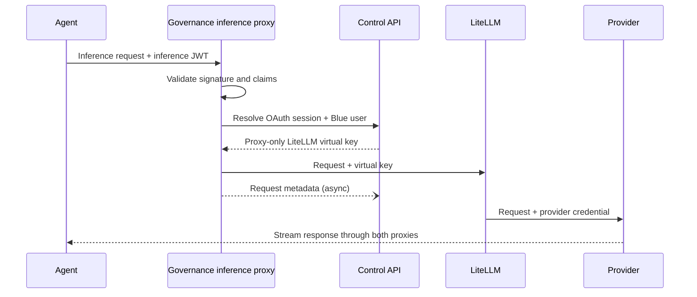

Gateway mode lets you bring your own organization-operated inference gateway. Blue supplies the governance-aware inference proxy and credential exchange; it does not bundle or operate the upstream gateway. LiteLLM is the first and currently only supported gateway type. Governance-only mode leaves inference untouched. Session capture is a separate feature and does not enable or require gateway mode.

## Compare the modes

| | Governance-only | Gateway mode |
| --- | --- | --- |
| Enabled by | Omitting top-level `gateway` | Adding one top-level `gateway` section |
| Inference route | Agent directly to its native provider or configured endpoint | Agent to Blue inference proxy, then your LiteLLM gateway, then provider |
| Client credential | The agent's native credential | A session-bound inference JWT |
| Provider and gateway keys | Managed by the developer's native agent setup | Remain in your server-side gateway deployment |
| Governance policy | Models, approvals, MCP, packages, and other managed configuration | The same policy plus launch-scoped gateway wiring |

The mode is selected once for the deployment policy and applies to every allowed coding agent.

## How gateway mode works



The Control API matches the signed-in governance user to a LiteLLM user by exact, case-insensitive email. The deployment provisions one managed key per user according to provisioner policy. The shipped LiteLLM provisioners use `blue:<email>` as the base key alias and add a numeric suffix if that alias is occupied. The Control API stores the resulting server-side virtual key only in PostgreSQL.

When the client fetches policy, the Control API requires its OAuth token's `sid`, verifies the active backing Better Auth session, and injects the inference proxy URL plus a session-bound inference JWT into the global gateway block. Each new Blue launch receives a fresh JWT limited to `gateway:infer` and to `gateway.inference_jwt.token_ttl_seconds` (12 hours by default), never outliving the backing session. Fetching policy does not extend that session — the dashboard owns its lifetime. The JWT is never persisted by the Control API, and the client never writes it to its config cache. The wrapper writes agent-specific routing for allowed agents. The inference proxy validates the JWT, resolves its Blue user and OAuth session through the M2M channel, and substitutes the server-side virtual key.

<Note>
  Gateway routing applies when an allowed agent is launched through `blue`. Starting the native agent command directly uses its native configuration and credentials.
</Note>

An already-running agent keeps its fixed launch expiry: the JWT is in the child process's environment and is not rotated in flight. Ten minutes before it expires, `blue` shows a countdown in the status row and offers to quit and reload the agent, which mints a fresh token. It never restarts on its own, because that would end an in-flight turn.

If the browser session ends — you sign out of the dashboard, or it simply expires — the CLI's next policy fetch gets a 401 and `blue` says so directly: a **Session expired — sign in** banner, a prompt to stop the agent and sign in, and `blue doctor` reporting `session : EXPIRED`. Logging back in from a live browser session restores gateway access; JWTs minted before the logout stay rejected.

Signing back in after `blue logout` reuses the same browser session, so gateway access resumes without a new browser sign-in.

## How governance-only mode works

With no top-level `gateway` block, Blue can still manage models, approval behavior, MCP servers, packages, and session-upload policy. It does not set gateway base URLs or inference tokens. Native agents own authentication and send inference to their normal providers or locally configured endpoints.

For an entirely governance-only deployment:

- Omit the top-level `gateway` section from `blue.yaml`.
- Do not start the Compose `gateway` profile.
- Configure provider credentials using each agent's native setup.

When the organization offers gateway mode, open Blue control and run `/direct` to switch the local client to native provider credentials. Blue removes gateway routing and inference tokens from its managed agent profile while continuing to apply models, approval behavior, MCP servers, packages, and session-upload policy. If an agent is running, Blue offers to quit and reload it; keeping the current session delays the runtime change until the next Blue restart. Run `/direct` again to restore organization gateway routing.

The selection is persisted as `force_governance_only` under `[mode]` in `blue.toml`. A client can only disable gateway routing offered by the service; it cannot enable gateway mode when the service has not declared it.

## Enable gateway mode

Gateway mode requires an organization-operated LiteLLM deployment, one Blue configuration section, and the Blue gateway services. The `litellm` adapter is the first supported integration. Contributors adding another type should follow [Gateway adapter architecture](/0.1.0/development/gateway-adapter-architecture) for the client, proxy, provisioner, and verification contracts.

<Steps>
  <Step title="Bring your LiteLLM gateway">
    Run your LiteLLM gateway with provider credentials and make it reachable from the Blue services. Create users whose emails match their governance identities; Blue creates and maintains each user's managed key.
  </Step>
  <Step title="Configure gateway mode">
    Add one top-level `gateway` section to `blue.yaml`. Its `type` enables routing for every allowed coding agent; the remaining settings connect the server runtime.
  </Step>
</Steps>

Configure gateway mode once in `blue.yaml`:

```yaml
gateway:
  type: litellm
  url: env://HARNESS_GATEWAY_URL
  inference_proxy_url: env://HARNESS_INFERENCE_PROXY_URL
  internal_allowed_client_id: blue-inference-proxy
  inference_jwt:
    issuer: https://api.blue.example.com
    audience: blue-inference-proxy
    active_kid: gateway-2026-09
    private_key_file: /var/run/blue/gateway-jwt/signing-key.pem
    jwks_file: /var/run/blue/gateway-jwt/jwks.json
  secret_encryption:
    provider: aws-kms
    key_id: arn:aws:kms:us-west-2:123456789012:key/example
  provisioner:
    type: builtin-litellm
```

The inference proxy authenticates to the Control API's internal resolver with a
short-lived OAuth2 **client-credentials** token minted by better-auth (the
dashboard), not a static shared secret. Configure the proxy with
`HARNESS_PROXY_OAUTH_TOKEN_URL`, `HARNESS_PROXY_OAUTH_CLIENT_ID`,
`HARNESS_PROXY_OAUTH_CLIENT_SECRET`, and `HARNESS_PROXY_OAUTH_RESOURCE` (the
Control API audience). The same `HARNESS_PROXY_OAUTH_CLIENT_SECRET` is given to
the dashboard as `HARNESS_INFERENCE_PROXY_CLIENT_ID` / secret so it can seed the
confidential client.

The internal transport is explicit. `mtls` is the default and recommended mode:
it encrypts resolved gateway credentials and requires the proxy to present a
trusted workload certificate. Mounted certificates rotate without restarting;
invalid rotations retain the last-known-good configuration. The Control API
also pins the token's `sub`, `client_id`, and `azp` claims to the configured
proxy client id.

The proxy's client certificate and private key may arrive as one combined PEM
(`HARNESS_PROXY_CLIENT_IDENTITY_FILE`) or as a separate pair
(`HARNESS_PROXY_CLIENT_CERT_FILE` and `HARNESS_PROXY_CLIENT_KEY_FILE`), matching
the split files the Control API already takes. Configure exactly one of the two;
setting both, or only half of the pair, is a startup error that names the
offending variable. Rotating either file of a split pair is picked up by the same
30-second reload.

`insecure-http` is available only as a deliberate trusted-network tradeoff.
OAuth M2M and NetworkPolicy isolation remain mandatory, but virtual keys are
plaintext on the wire and there is no client-certificate check. A VPC or an API
gateway at ingress does not encrypt this east-west hop. Account for compromised
workloads or nodes, packet capture, service misrouting, and policy enforcement
gaps before selecting it.

| Setting | Purpose |
| --- | --- |
| `HARNESS_GATEWAY_TYPE` | Required inference-proxy adapter key; must match top-level `gateway.type` |
| `HARNESS_GATEWAY_URL` | Upstream inference gateway URL shown in the dashboard overview |
| `HARNESS_INFERENCE_PROXY_URL` | Client-reachable URL injected into personalized harness policy |
| Provisioner | In-process built-in or pinned deployment-trusted executable selected by `gateway.provisioner.type` |
| Secret encryption | Environment key for development or AWS KMS key ID for production envelope encryption |
| `HARNESS_PROXY_OAUTH_CLIENT_SECRET` | Client-credentials secret the inference proxy uses to obtain a Control API token (shared with the dashboard seed) |
| Gateway JWT key ring | Active RS256 private key plus a JWKS containing its public key and retained rotation keys |
| `HARNESS_GATEWAY_JWKS_URL` | M2M-protected internal Control API endpoint used by the proxy to verify inference JWTs |
| `internal_allowed_client_id` | OAuth client id (`sub`) the Control API accepts on the internal resolver; defaults to `blue-inference-proxy` |
| `HARNESS_GATEWAY_LOG_URL` | Internal Control API request-log ingestion endpoint; omit to disable egress |
| `HARNESS_GATEWAY_EVENT_URL` | Internal credential-invalidation event stream; defaults from the resolver URL |
| `HARNESS_GATEWAY_REQUEST_LOG_RETENTION_DAYS` | Request metadata retention in days; defaults to `30` |

Start the inference proxy and Control API, then verify that the user exists in the gateway. The dashboard **Gateway** page shows runtime readiness and the user's single managed key without exposing its credential.

Users can provision or reconcile the key on that page or from the CLI:

```bash
blue gateway
blue apply
blue codex
```

Harness launch performs the same lazy ensure operation. Personalized policy cannot be delivered until provisioning succeeds.

## Disable or change routing

Remove the top-level `gateway` section to return all agents to governance-only behavior, remove the Gateway dashboard page, and stop gateway personalization.

Changing provisioner configuration reconciles the managed credential and revokes a superseded gateway identifier. Run `blue apply` or let the daemon reconcile after policy changes.

## Common failures

| Symptom | Cause and action |
| --- | --- |
| Gateway page says runtime is incomplete | Set all four runtime settings and restart the Control API and inference proxy. |
| No matching gateway account | Create a LiteLLM user whose email matches the governance identity. |
| Managed key provisioning fails | Run `blue gateway` and inspect the provisioner and gateway logs. |
| Gateway unavailable | Verify the Control API and inference proxy can reach `HARNESS_GATEWAY_URL` and the admin key is valid. |
| Agent still connects directly | Launch it through `blue` and ensure the global `gateway` policy is present. |

<Warning>
  Keep the LiteLLM admin key, inference-proxy OAuth secret, JWT signing key, virtual keys, and provider credentials out of governance YAML and client configuration. Only the session-bound inference JWT and client-reachable proxy URL are delivered to a developer machine.
</Warning>
