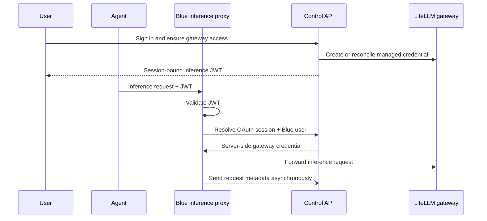

Gateway access connects the Blue inference proxy to the inference gateway your
organization operates. Blue does not bundle the upstream gateway; LiteLLM is
the first and currently only supported gateway type. It is independent of
[session capture](/0.2.0/admin/session-capture): enabling either feature does
not enable the other.

## Responsibilities and data flow



Blue stores the gateway credential envelope-encrypted and gives the client a
session-bound, inference-only JWT. Provider credentials, LiteLLM administrator
credentials, the signing key, and the managed gateway key remain server-side.

## Prerequisites

- A global `gateway` block in `blue.yaml`.
- Your reachable LiteLLM gateway and the Blue inference proxy.
- A provisioner selected by `gateway.provisioner.type`.
- Encryption configured for stored gateway credentials.
- Matching user identities in Blue and the gateway.

Choose one provisioner model. The built-in LiteLLM provisioner matches users
by exact, case-insensitive email. A
[custom executable provisioner](/0.2.0/admin/custom-gateway-provisioners) can
apply another identity, account, team, budget, or credential policy.

## Configure gateway access

<Tabs>
<Tab title="Built-in LiteLLM">
```yaml blue/blue.yaml
gateway:
  type: litellm
  url: os.environ/HARNESS_GATEWAY_URL
  inference_proxy_url: os.environ/HARNESS_INFERENCE_PROXY_URL
  internal_allowed_client_id: blue-inference-proxy
  secret_encryption:
    provider: aws-kms
    key_id: os.environ/HARNESS_GATEWAY_KMS_KEY_ID
  provisioner:
    type: builtin-litellm
    reconcile_ttl_seconds: 86400
```

The built-in implementation uses `HARNESS_LITELLM_ADMIN_KEY` and the configured
gateway URL. It does not use executable fields.
</Tab>

<Tab title="Custom executable">
```yaml blue/blue.yaml
gateway:
  type: litellm
  url: os.environ/HARNESS_GATEWAY_URL
  inference_proxy_url: os.environ/HARNESS_INFERENCE_PROXY_URL
  internal_allowed_client_id: blue-inference-proxy
  secret_encryption:
    provider: aws-kms
    key_id: os.environ/HARNESS_GATEWAY_KMS_KEY_ID
  provisioner:
    type: organization-gateway
    executable_path: /var/run/blue/provisioner/provisioner
    executable_sha256: 0123456789abcdef0123456789abcdef0123456789abcdef0123456789abcdef
    policy_revision: organization-gateway-v1
    reconcile_ttl_seconds: 86400
    timeout_seconds: 15
```

The path must be absolute and identify a regular executable file. Blue verifies
the lowercase SHA-256 pin and execute bit at Control API startup. The policy
revision is required and should change whenever executable policy changes.
</Tab>
</Tabs>

Keep the gateway administrator key, the inference proxy's OAuth client secret,
provider credentials, and encryption credentials in the runtime Secret, not in
`blue.yaml`.

| Runtime setting | Purpose |
| --- | --- |
| `HARNESS_GATEWAY_TYPE` | Required inference-proxy adapter key; must match top-level `gateway.type`. |
| `HARNESS_GATEWAY_URL` | Internal upstream gateway URL used by the Control API and provisioner. |
| `HARNESS_INFERENCE_PROXY_URL` | Client-reachable inference proxy URL injected into personalized policy. |
| `HARNESS_LITELLM_ADMIN_KEY` | Administrator credential used only to provision and reconcile LiteLLM access. |
| Provisioner-specific variables | Administrator credentials and settings inherited by a custom executable. Define their names in your deployment Secret. |
| `HARNESS_PROXY_OAUTH_CLIENT_SECRET` | Client-credentials secret the inference proxy uses to obtain a short-lived Control API token (shared with the dashboard client seed). |
| `HARNESS_GATEWAY_KMS_KEY_ID` | Production KMS key used for envelope encryption. |
| `HARNESS_GATEWAY_REQUEST_LOG_RETENTION_DAYS` | Request-metadata retention; defaults to `30`. |

See [Bring your own gateway](/0.2.0/concepts/gateway-mode) for deployment topology and
[Blue YAML](/0.2.0/deployment/blue-yaml) for the complete configuration schema.

## Provision and reconcile a user

Users can provision from the dashboard's **Gateway** page or the CLI:

```bash
blue gateway
```

Harness launch performs the same ensure operation lazily. If provisioning
fails, Blue blocks personalized gateway policy delivery instead of launching
with incomplete routing credentials.

When status is ready, the dashboard's **Key** tab also calls `POST /gateway/key/validate`. Validation rechecks the upstream key at most once every 60 seconds. A confirmed invalid credential is cleared and reported as `invalid`; replacement requires the ensure operation, such as running `blue gateway`. A missing credential is reported without contacting the provisioner.

The provisioner receives the authenticated Blue identity, ensure reason, and
the previous external ID, alias, and metadata when a credential already
exists. It creates a credential when none exists, updates it when configuration
or `policy_revision` changes, and periodically reconciles it after the TTL.
Harness launch and personalized configuration fetch both ensure access before
governed inference begins.

An executable can return `credential: null` only when retaining the previous
encrypted credential. A rotated credential causes Blue to replace the stored
encrypted value and invalidate cached credential mappings. If ensure fails,
Blue records the public error, stores no partial
result, and retries on the next governed launch or configuration fetch.

<Note>
  Relaunch gateway-routed harnesses after credential rotation or access-profile
  changes. A process that is already running retains the configuration it
  received at launch.
</Note>

## Dashboard and permissions

The **Gateway** page appears only when gateway policy is active.

- **Key** is visible to members and administrators and shows managed access status without exposing plaintext credentials.
- **Overview** is administrator-only and shows upstream and client-facing endpoints, supported harnesses, proxy health, and a non-secret runtime checklist.
- **Logs** is administrator-only and shows organization-wide request metadata and filters.

Members can see their own credential status but cannot see request records. API role checks enforce the same boundaries as the dashboard.

## Request history

Blue records metadata for authenticated requests forwarded through the proxy,
including upstream errors and transport failures. Filters include user, key,
model, harness, result, and date. Records can include allowlisted repository,
branch, commit, dirty-state, and run attribution.

Blue does not store prompts, request or response bodies, credentials, query
strings, inference JWTs, virtual keys, or arbitrary headers in request history.
Delivery is asynchronous and best effort so a Control API logging failure does
not delay inference traffic. Expired database rows are removed automatically
after `control_api.gateway_request_logs.retention_days`.

## Change or disable access

- Change provisioner policy and its policy revision to reconcile existing
  credentials.
- Remove a user's gateway access through the source gateway or identity policy;
  Blue retries idempotent revocation where applicable.
- Remove the top-level `gateway` block to disable gateway personalization for
  the deployment. Native agents then use their normal provider configuration.
- Stop the inference proxy after the policy no longer advertises gateway mode.

Starting an agent binary directly bypasses Blue's launch-time gateway wiring.
Launch through `blue`, for example `blue codex`.

## Troubleshooting

| Symptom | Check |
| --- | --- |
| Gateway page is absent | Confirm the active global policy contains `gateway`. |
| Runtime is incomplete | Verify gateway URL, proxy URL, OAuth client-credentials settings, encryption, and provisioner settings; then restart the services. |
| Account is missing | Ensure the gateway identity email matches the authenticated Blue email. |
| Provisioning is rejected | Check provisioner and gateway logs with secret redaction; verify the administrator key and team/model policy. |
| Executable fails startup validation | Verify its absolute path, regular-file type, execute bit, lowercase SHA-256 pin, and non-empty policy revision. |
| Executable times out or returns malformed JSON | Check the configured timeout and version 1 JSON contract. Keep stdout reserved for one response envelope. |
| Proxy health fails | Verify the browser/client can reach the public proxy and the proxy can reach the Control API and gateway. |
| Agent still calls a provider directly | Reconcile policy, confirm the harness is supported, and launch it through `blue`. |
| Logs are absent | Verify the log ingestion URL and authentication. Logging is best effort and can be disabled independently of routing. |

<Warning>
  Never deliver a provider key, LiteLLM administrator key, or server-side
  virtual key or signing key to a developer machine. Only the session-bound
  inference JWT and client-reachable proxy URL belong in personalized harness configuration.
</Warning>
