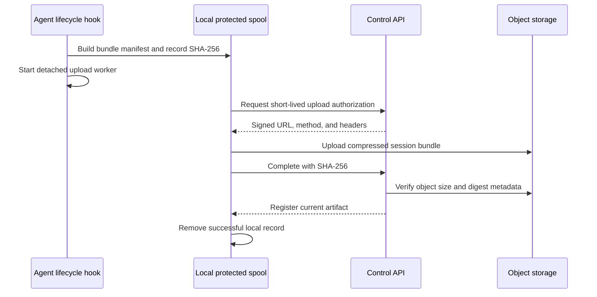
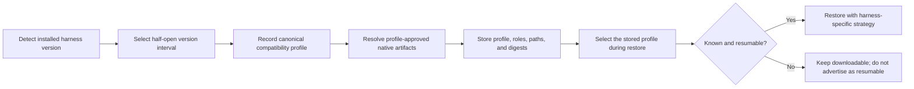
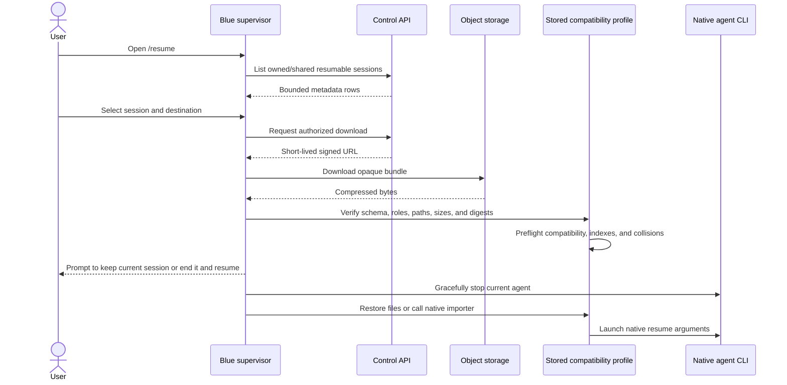

Session capture packages a supported coding agent's safe session-owned artifacts into a versioned, integrity-checked bundle and uploads it to
organization-controlled object storage after its lifecycle hook runs. It is
independent of [gateway access](/next/admin/gateway-access) and does not inspect
inference-proxy traffic.

<Warning>
  Native transcripts can contain prompts, model responses, source fragments,
  tool inputs and outputs, file paths, and secrets exposed during a session.
  Define disclosure, access, encryption, retention, incident response, and
  deletion policy before enabling capture.
</Warning>

## Upload architecture



The hook first spools data atomically, then starts a detached worker so a
short or non-awaited agent shutdown hook cannot truncate the upload. The worker
claims records to avoid duplicate concurrent processing and retries transient
failures. Failed records remain in the local spool for a later worker run.

Object storage is opaque to Blue's service layer. The bundle manifest carries
the information needed to validate and restore an object, but both the Control
API and the restoring client repeat the checks appropriate to their trust
boundary. A successful transport checksum alone does not make an archive safe
to extract.

## Prerequisites

- A separate S3-compatible bucket for session bundles and legacy raw captures.
- Workload identity or ambient credentials with scoped object permissions.
- A client version and installed harness version with a verified session-hook
  compatibility profile.
- A public presign endpoint reachable from developer workstations.
- An object lifecycle rule aligned with your retention policy.

Do not reuse the managed-package bucket. Package artifacts can be referenced
indefinitely, while session objects are expected to expire.

## Configure storage

Configure the Control API's S3-compatible backend in `blue.yaml`:

```yaml blue/blue.yaml
control_api:
  blob_storage:
    bucket: os.environ/HARNESS_BLOB_BUCKET
    region: us-west-2
    retention_days: 30
```

For non-AWS S3-compatible storage, also configure its endpoint, public
endpoint, and path-style behavior as described in
[Blue YAML](/next/deployment/blue-yaml). The internal endpoint is used by the
service; any signed upload URL must be reachable from client machines.

`retention_days` records each artifact's deadline. The current release does
not include a background object-deletion worker, so configure a bucket
lifecycle rule or an external cleanup job for actual deletion.

## Enable capture in governance policy

Add one top-level policy:

```yaml
session_upload:
  presign_url: https://control.example.com/session-uploads/presign
```

`session_upload` is global. Do not place it under an individual harness. On
reconciliation, each selected compatibility interval registers a native managed
hook when that interval supports the required lifecycle event. Other intervals
still reconcile policy and report that capture is inactive. Removing the
top-level block removes Blue-managed capture hooks without removing unrelated
user hooks.

The installed Blue version chooses a tested compatibility profile such as
`claude-v2_0_12`. That profile is stored with captured metadata so the hook payload
and transcript lookup remain tied to the harness generation that produced it.
Unsupported versions still reconcile other policy, but warn that session
capture is inactive.

## What is uploaded

New clients upload `blue-session-bundle-v1`, a gzip-compressed tar containing `manifest.json` and adapter-approved regular files. The manifest records the schema, harness profile, native ID, capture time, working directory, available Git identity, native title or bounded prompt preview, and a SHA-256 and size for every file. Capture and restore reject symlinks, unsafe paths, duplicate entries, unsupported file types, oversized content, and digest mismatches. Older clients may still upload a single raw artifact; those records remain downloadable but are marked non-resumable.

Bundles contain the native data needed by each harness:

- Codex: rollout JSONL and native index-derived display metadata.
- Claude: primary JSONL, session-owned subagent transcripts, metadata, and externalized tool results.
- Kimi: sanitized `state.json`, agent wire histories, plans, and attachments. Credentials, approval grants, processes, cron jobs, queued goals, and logs are excluded.
- OpenCode: its native export-shaped session and messages JSON, restored through `opencode import`.

## How titles and previews are generated

Blue does not ask a model to name or summarize a session. It uses only metadata
and conversation data already written by the native harness, in this order:

1. Find the record for the exact native session ID in the harness's native
   session index or export metadata. ID fields such as `id`, `session_id`, and
   `sessionId` are recognized so a supported profile can tolerate native naming
   differences.
2. Prefer a native title or summary field. Recognized title fields include
   `title`, `session_title`, `thread_name`, `name`, and `summary`. Recognized
   preview fields include `summary`, `firstPrompt`, `prompt`, and `preview`.
3. If no native preview exists, scan the primary transcript for the first user
   turn. The extractor accepts JSON documents and JSONL records, nested
   `message` or `info` objects, and text represented as a string, content array,
   parts array, or prompt field.
4. Skip Blue-injected environment and `AGENTS.md` context when choosing the
   first-user fallback. Normalize whitespace, bound the stored preview to 1,024
   characters, and derive an 80-character title from it when no native title is
   available.

The manifest enforces a 256-character title bound even when a native index
contains a longer value. The dashboard applies a four-line visual clamp, while
the CLI renders a shorter row preview to keep the picker aligned. The complete
native transcript remains inside the bundle; title truncation does not modify
session content.

## Compatibility profiles and native parsing

Blue treats native session storage as a versioned adapter contract rather than
one format shared by every release.



Version detection accepts each harness's registered version-output forms and
normalizes them to semantic versions. Registrations use half-open ranges:
`introduced` is inclusive and `before` is exclusive. Every range also has an
exclusive `verified_before` certification ceiling. A new native layout gets a
new profile and operation set; shipped profiles are retained so existing
bundles do not silently switch parsers when Blue is upgraded.

The profile stored in the manifest controls validation of the source bundle.
An unknown profile, a profile without `session_resume`, an unexpected artifact
role, or a native path outside that harness's session root fails before native
files are written. Launch still goes through Blue's normal installed-version
and governance eligibility checks for the destination machine.

| Harness | Version-aware handling |
| --- | --- |
| Codex | Portable capture begins with the profile whose native lifecycle supports `SessionEnd`. The bundle requires exactly one rollout under `.codex/sessions`; earlier captures stay downloadable but non-resumable. Display metadata is matched by native session ID before the rollout fallback is scanned. Restore places the rollout at its native path and invokes the explicit `codex resume <id>` path; it does not overwrite Codex database state. |
| Claude | Only profiles with a uniform portable capture contract are resumable. Blue captures the primary project JSONL and session-owned companion subtree, accepts the supported native index container shapes, and merges a new entry without replacing unrelated sessions. Older pre-hook and hooks-only profiles remain non-resumable. |
| Kimi | The adapter accepts the hook path or searches only the documented managed/native session roots for the exact session ID. It captures all agent histories, plans, and attachments, sanitizes `state.json`, and recognizes existing index IDs written as `session_id`, `sessionId`, or `id`. |
| OpenCode | Blue writes the native export shape `{info, messages}` instead of parsing OpenCode's private database. Restore delegates format interpretation to `opencode import`, reads the imported ID reported by the CLI, and resumes that ID. |

<Note>
  Compatibility profiles protect known storage layouts; they do not make an
  old bundle compatible with every future vendor release. Certification tests
  advance each profile's `verified_before` ceiling only after the locked native
  CLI version has been exercised.
</Note>

Blue calculates the completed archive's SHA-256 and byte size before requesting an upload.
The presign request includes:

| Field | Purpose |
| --- | --- |
| `harness` | Canonical harness name. |
| `compatibility_profile` | Adapter used to interpret the lifecycle payload and locate the transcript. |
| `session_id` | Native harness session identifier. |
| `sha256` and `size_bytes` | End-to-end integrity checks. |
| `content_type` | Media type sent with the object. |
| `cwd` | Working directory attribution, when available. |
| `artifact_format` and `resumable` | Portable format and whether this profile supports native restoration. |
| `title` and `summary` | Bounded native title/summary or prompt preview; Blue does not invoke a model to create these. |
| Repository and capture time | Available Git root/remote identity and source timestamp. |

The client uploads directly to object storage with the returned short-lived
method, URL, and signed headers. Completion succeeds only after the Control API
verifies object size and SHA-256 metadata.

## Browse and download sessions

PostgreSQL stores searchable session metadata and artifact history; object
storage contains raw bytes. Administrators see all sessions in their
organization for audit. Members see sessions they own or that an owner shared with them. The CLI resume picker is narrower for every role, including administrators: only owned or explicitly shared resumable sessions appear.

The Sessions dashboard supports search by native title, summary/preview, session ID, or working directory and filters for harness, user, status, and update date. Owners may keep a session private, share it with all active workspace members, or select active recipients. Recipients can only view, download, and resume; they cannot edit, delete, or re-share. Revocation cannot remove a copy already restored locally. Status values
include `pending`, `complete`, `superseded`, and `failed`. Opening a session
shows its metadata and artifact history. Downloads use a new short-lived
presigned URL and are rejected after the retention deadline.

## Resume a remote session

Open Blue's control menu and run `/resume`. Blue opens a dedicated resume screen showing the native title, harness, owner/shared state, source path, and update time. If the recorded directory differs from the current directory, choose the current directory, the recorded directory when it still exists locally, or another existing destination. Blue downloads and verifies the bundle and checks compatibility, repository identity, and local-ID collisions while the current agent remains running. A repository mismatch has its own confirmation before the final active-session prompt. That final prompt defaults to **Keep current session**; resuming requires explicitly selecting **End current session and resume**. Blue then restores native files atomically, rebuilds supported native indexes, and launches the selected harness with its native resume arguments. Blue does not clone repositories or transfer working-tree changes, credentials, approvals, active processes, or scheduled work.



Cancellation and every failure through preflight leave the active agent
running. Blue never silently changes the working directory and never overwrites
a different local session with the same native ID. Codex and Claude resume by
native ID, Kimi launches with `--session`, and OpenCode launches the ID returned
by its native importer.

## Rotation, retries, and duplicate uploads

Uploading the same native session again can create a new artifact revision.
The newest verified artifact becomes current and older artifacts remain in
history until retention removes them. The worker verifies its own spooled bytes
before every upload and deletes local copies only after successful completion.

The hook path is intentionally non-blocking. A successful agent shutdown does
not prove that remote registration completed; use the dashboard and service
logs for confirmation.

## Disable capture

<Steps>
  <Step title="Stop creating new captures">
    Remove the top-level `session_upload` block and publish a new policy
    revision. Clients remove Blue-managed hooks when they reconcile.
  </Step>
  <Step title="Handle existing local spools">
    Decide whether clients should finish uploading already-spooled sessions or
    remove them according to your incident and retention policy. A worker that
    fetches policy after capture is disabled does not upload the record.
  </Step>
  <Step title="Retain or delete stored artifacts">
    Removing policy does not delete PostgreSQL metadata or object-storage
    artifacts. Apply your documented deletion workflow and bucket lifecycle.
  </Step>
</Steps>

## Troubleshooting

| Symptom | Check |
| --- | --- |
| No capture hook appears | Confirm `session_upload` is top-level, the harness is allowed, and its installed version has a compatible profile. |
| Hook reports no session ID | Inspect the native lifecycle payload and verify it matches the selected compatibility profile. |
| Presign fails | Verify login/session token, endpoint reachability, organization scope, and Control API storage configuration. |
| Object upload fails | Verify the signed URL is workstation-reachable and required signed headers are returned unchanged. |
| Completion fails | Compare object size and SHA-256 metadata with the presign request. |
| Record remains pending | Inspect the detached worker, Control API, and object-store logs; failed local spool records are retained. |
| Download is unavailable | Confirm the artifact is complete, visible to the caller, and inside its retention deadline. |
| Expired objects remain | Configure the required object-store lifecycle rule or external deletion job. |
