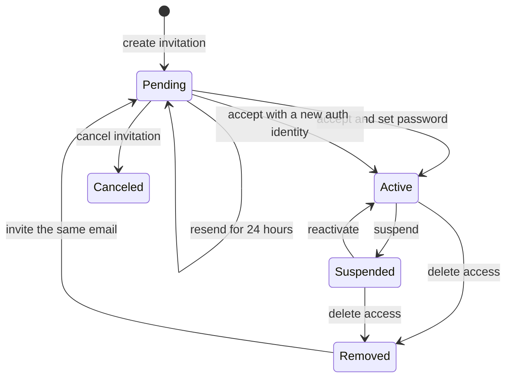

In password mode, Blue uses invitation-only onboarding. Administrators choose an email and role; the recipient follows the invitation link and sets a password. In OIDC mode, invitations are disabled and the identity provider provisions users and groups through SCIM. See [Identity provider provisioning](/next/admin/identity-provisioning).

## Account lifecycle



A removed user keeps the same governance user ID when the email is invited again. This preserves ownership of configuration revisions, client reports, and captured sessions across removal and reactivation.

## User APIs

All routes require an `admin` role and are restricted to the caller's organization. They accept either the HTTP-only dashboard session cookie or an audience-bound bearer token.

| Method and path | Purpose |
| --- | --- |
| `GET /admin/users` | List users. Paginate with `page` and `per_page`; filter with `q` (email or subject), `role`, `status`, or `provisioning_source`. Returns `{items,page,per_page,total,total_pages}`. |
| `GET /admin/users/{id}` | Read one organization user. |
| `PATCH /admin/users/{id}` | Change `role` and/or set `status` to `active` or `suspended`. |
| `POST /admin/users/{id}/sessions/revoke` | Revoke all browser, OAuth, and device sessions. |
| `DELETE /admin/users/{id}` | Delete authentication access while retaining identifiable history. |

```bash
curl -X PATCH "$CONTROL_API/admin/users/$USER_ID" \
  -H "Authorization: Bearer $ACCESS_TOKEN" \
  -H "Content-Type: application/json" \
  -d '{"role":"admin"}'
```

Role changes and suspension invalidate existing browser and CLI credentials. Reactivation permits the existing password to be used again but does not restore old sessions. The deployment-managed bootstrap administrator is protected, and an organization must always retain at least one active administrator. Administrators cannot demote, suspend, or delete themselves.

SCIM-managed users expose `provisioning_source: "scim"` and `managed: true`. Their role and lifecycle endpoints reject local changes; administrators retain session revocation as an emergency response.

## Invitation APIs

| Method and path | Purpose |
| --- | --- |
| `GET /admin/invitations` | List invitations, including accepted, canceled, and computed expired states. Paginate with `page` and `per_page`; filter with `status=outstanding`, `q` (email), or `role`. Returns `{items,page,per_page,total,total_pages}`. |
| `GET /admin/invitations/{id}` | Read one organization invitation. |
| `POST /admin/invitations` | Invite an email with an `admin` or `member` role. |
| `POST /admin/invitations/{id}/resend` | Renew a pending or expired invitation for 24 hours. |
| `DELETE /admin/invitations/{id}` | Cancel a pending invitation. |

```bash
curl -X POST "$CONTROL_API/admin/invitations" \
  -H "Authorization: Bearer $ACCESS_TOKEN" \
  -H "Content-Type: application/json" \
  -d '{"email":"developer@example.com","role":"member"}'
```

The reference deployment writes the acceptance URL to the Control API log. Configure `HARNESS_AUTH_PUBLIC_URL` to the public dashboard origin so the emitted link is usable outside the container network. A production deployment can replace the log delivery boundary with its mail adapter.

## Suspension and deletion

Suspension retains the Better Auth account and organization membership but prevents authentication. It revokes credentials, removes the local gateway selection, and attempts to revoke the server-held LiteLLM virtual key.

Deletion removes the Better Auth account, password, memberships, sessions, OAuth grants, pending device codes, credentials, and gateway selection. It intentionally retains:

- the governance user ID, subject, email, role, and `removed` state;
- configuration revision authorship;
- client status and captured-session metadata;
- captured-session artifacts and their existing retention deadlines.

Remote gateway-key cleanup is best effort. Gateway auth sessions are revoked transactionally, so governed clients lose gateway access even if the upstream gateway is unavailable.

<Warning>
  `DELETE /admin/users/{id}` is access removal, not a privacy-erasure API. Organizations that require anonymization or historical-data deletion need a separate retention workflow.
</Warning>

## Dashboard workflow

Open **Members** in the administrator sidebar. The page provides the same API operations for role changes, suspension and reactivation, session revocation, access deletion, and invitation resend or cancellation. Destructive actions require confirmation, and prohibited bootstrap, self, and last-administrator operations are disabled or rejected by the API.

In managed OIDC mode, **Members** also shows an **Identity & provisioning** tab backed by `GET /admin/identity/status`. It summarizes OIDC and SCIM readiness without exposing secrets.
