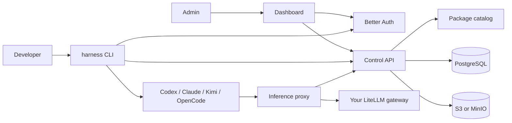
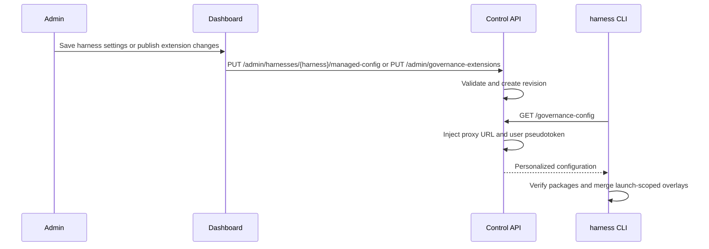
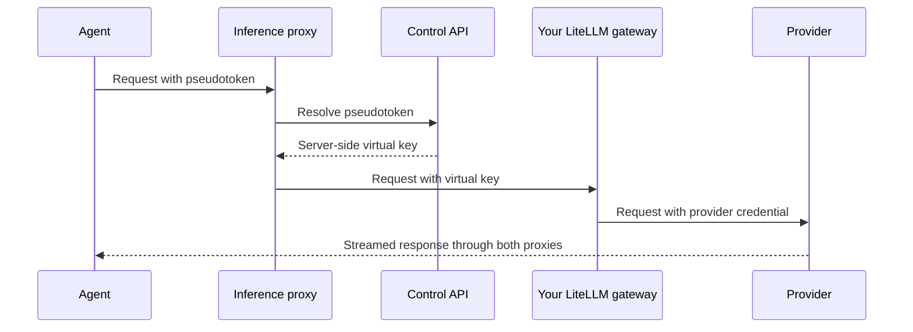

The repository contains one Rust CLI, a Rust Control API, a Rust inference proxy, and a Next.js administration dashboard. PostgreSQL stores identities, policy revisions, client state, gateway selections, and session metadata. Raw session bytes live in S3-compatible object storage.

## Configuration delivery

The database revision is the source of truth for organization policy. Gateway `proxy_url` and `pseudotoken` are not stored in that YAML: the Control API injects them into an authenticated user's response at delivery time.

## Package ownership

The package catalog supplies reviewed, immutable metadata; package archives remain external HTTPS artifacts. The client verifies each archive digest, rejects unsafe entries, and stores content by package ID and digest under the metaharness root. An ownership manifest records activation and recursive hashes.

Harness adapters expose package content only through governed launches: Claude plugin arguments, a Codex governed profile, Kimi's isolated home and skill arguments, or OpenCode's explicit overlay. Teardown first removes those references, then deletes unchanged owned content or quarantines drifted content.

## Gateway inference

Blue's optional inference proxy connects governed agents to an upstream gateway operated by your organization. Blue does not bundle that gateway; LiteLLM is the first and currently supported adapter.

Neither the LiteLLM virtual key nor provider credentials are written to the developer machine.

## Replaceable boundaries

The reference backend is optional. Another service can replace it if it implements the published service contract and OAuth expectations. Blob uploads use provider-neutral presign responses even though the reference implementation uses the S3 API.
