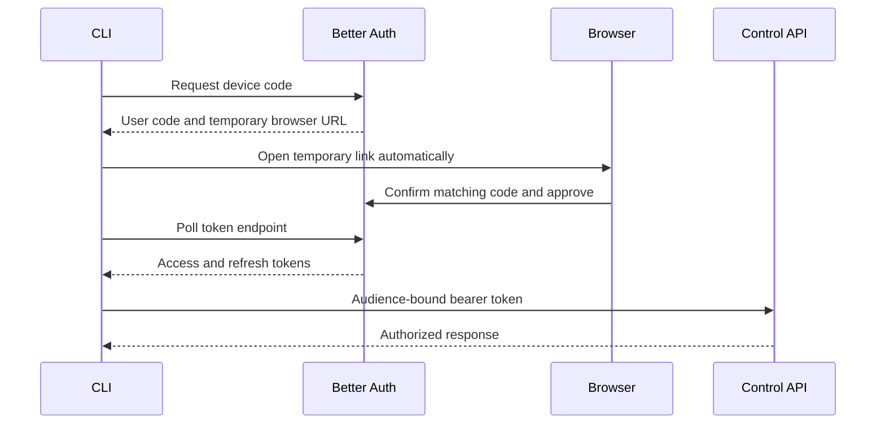

The dashboard and CLI authenticate differently. Better Auth owns both flows, but a browser session cookie is never reused as a CLI credential.

## Dashboard users

The workspace runs in either local password mode or managed OIDC mode. The login page asks for email first, then either requests a password or redirects to the configured identity provider. Better Auth issues HTTP-only browser sessions and publishes signing keys for API token verification. OIDC mode permits only active, SCIM-provisioned identities plus the protected password-based bootstrap administrator.

## CLI device authorization

The browser URL contains an opaque, short-lived token rather than the user code. The page displays the code read-only for comparison with the terminal and offers explicit authorize and deny actions. If the default browser cannot be launched, the CLI prints the link and continues polling.

Access tokens expire after 15 minutes. Refresh tokens rotate and are stored with the session in `~/.config/blue/session.json` using owner-only permissions. Each refresh replays the resource indicator the grant was issued against, so the renewed token keeps the same Control API audience. `blue logout` attempts remote revocation and always removes the local token file.

### Session binding and re-authorization

The device grant is bound to the browser session that approved it, and gateway mode reads that binding every time it mints an inference token. The two lifetimes differ: the browser session lasts 12 hours, the refresh token 30 days. A CLI session can therefore keep refreshing its access token long after the sign-in behind it has expired, and the Control API answers `401` with the reason.

`blue login` verifies with the service rather than trusting the local expiry, so it reports a rejected session instead of "Already logged in". When the deployment uses device authorization, it starts a new one; `blue` does the same at launch. An unreachable service is reported as unverified and never triggers a browser flow.

Use `blue login --force` to re-authorize while a session is still valid — switching accounts, or replacing a session you no longer trust. It revokes the gateway session before starting the new flow and the stored refresh token once the replacement exists, so neither the old grant nor any inference token minted from it is left live server-side. Cancelling at the browser leaves the existing session intact.

## Scopes

| Scope | Purpose |
| --- | --- |
| `governance:read` | Read personalized governance policy and gateway key metadata |
| `session:write` | Presign and complete raw-session uploads |
| `client-status:write` | Report installed harnesses and reconciliation health |
| `gateway:resolve` | Resolve validated user/session pairs for the inference proxy's internal gateway requests |

Administrative endpoints additionally require an administrator role in the same organization. Session visibility is organization-scoped; non-admin users see only their own captured sessions.

User-management operations invalidate browser, OAuth, and device credentials when roles or access states change. The Control API also records a token cutoff and rejects previously issued bearer tokens, so an administrator claim cannot remain usable until its normal expiry. See [Manage users and invitations](/next/admin/user-management).

## Gateway identity

Gateway access matches the authenticated governance user to LiteLLM by case-insensitive email. The deployment provisions one managed key per user; a missing LiteLLM user produces a provisioning error. Run `blue gateway` to provision or reconcile it.
