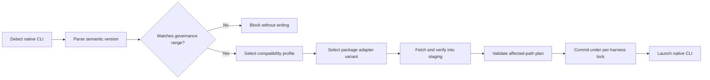

Blue does not bundle agent harnesses. It detects the native CLI already on `PATH`, reads its version, and selects a compiled compatibility profile before it writes managed files or launches the process. When an installed version is incompatible, an interactive CLI can offer to run the catalog-defined vendor installer after explicit confirmation.

## Reconciliation flow



The selected profile owns the native representation of managed settings, MCP servers, gateway wiring, session hooks, skills, subagents, plugins, helpers, environment variables, and launch arguments. Governance and packages remain declarative inputs.

## Pin an allowed range

Set `version_requirement` under the harness policy. Blue uses semantic-version requirement syntax.

```yaml
minimum_client_version: "0.1.0"
contract_version: 3
required_capabilities: [adapter_intervals, compiled_harness_registry, transactional_reconcile, versioned_state]
harnesses:
  codex:
    version_requirement: ">=0.149.0, <0.150.0"
    managed_config:
      model: gpt-5.6-sol
```

An exact pin uses `=0.149.1`. Omitting the field allows any installed version covered by a maintained client profile. The Control API records `minimum_client_version` for rollout visibility and requires the corresponding capabilities, which prevent an older Blue client from silently ignoring the constraint.

Every profile also has an exclusive certified release ceiling. A release tested through `0.151.0` uses `0.151.1-0` as its ceiling so prereleases of the next patch are blocked too. Blue blocks a newer release until that release is exercised and the ceiling advances. To deliberately accept a newer, untested release, constrain it explicitly and opt in:

```yaml
required_capabilities:
  - adapter_intervals
  - compiled_harness_registry
  - transactional_reconcile
  - unverified_harness_versions
  - versioned_state
harnesses:
  codex:
    version_requirement: ">=0.151.1, <0.152.0"
    allow_unverified_versions: true
```

The opt-in is rejected without `version_requirement`. Reconciliation and inventory continue with a warning because vendor changes beyond the certified ceiling may produce invalid configuration.

<Warning>
  A missing, unparsable, or policy-incompatible native harness version fails closed. Blue preserves the last managed state but does not rewrite files or launch that harness with a guessed format.
</Warning>

Run `blue apply` or launch through `blue run` to see the normalized version, selected profile, and compatibility error. Blue performs compatibility preflight only for the default or explicitly launched harness before changing its files.

## Repair an incompatible installation

In a terminal, `blue run` and `blue apply` identify the detected executable's
installation method before offering repair. The prompt shows the active path,
method, exact release, and command. The default answer is **No**. Blue never
falls back to another installer if the installation method is unrecognized or
unsupported, or if an installer fails.

| Installation | Recognition evidence | Repair |
| --- | --- | --- |
| npm-compatible global layout (all four harnesses, Unix) | `<prefix>/bin/<agent>` resolves to the expected package under `<prefix>/lib/node_modules`; package name and `bin` target match the resolved executable, and the package directory equals its canonical path (no linked or redirected package directories) | `npm install -g --prefix <detected-prefix> <package>@<exact-version>` |
| Claude native (Unix) | Native binary in `~/.local/share/claude/versions/<version>`, reached through `~/.local/bin/claude`; relative symlink chains are resolved | Detected executable: `install <exact-version>` |
| Homebrew Claude/Codex/OpenCode | Resolved target under the matching `Caskroom` or `Cellar` package, including custom prefixes | Refuse automatic arbitrary-version pinning; manually migrate to npm or use a compatible vendor/Homebrew installation |
| Kimi standalone (Unix) | Regular native binary at the documented default `~/.kimi-code/bin/kimi`, without redirected parent directories | Official installer with exact `--version`, `KIMI_INSTALL_DIR`, and `KIMI_NO_MODIFY_PATH=1`; the child PATH excludes the installation's bin so the installer skips legacy migration |
| Kimi legacy uv tool | Target belongs to a Python environment with `uv-receipt.toml` identifying `kimi-cli` and `pyvenv.cfg` | Refuse: legacy Python versions are not the current Kimi CLI; manually migrate to npm |
| OpenCode standalone (Unix) | Regular native binary at the default `~/.opencode/bin/opencode`, without redirected parent directories | Detected executable: `upgrade <exact-version> --method curl` |
| Codex standalone/release download, custom Kimi/OpenCode roots, pnpm/bun wrappers, Windows wrappers/native layouts, other unrecognized layouts | No supported installation layout | Refuse automatic replacement; manually install a policy-compatible release or migrate to npm |

A manually copied package matching the npm-compatible layout is also eligible
for npm repair. Recognition uses only filesystem checks and does not prove npm
originally installed the package; detection does not run npm or any other command.

The standalone installers leave no ownership receipt. Blue limits recognition
to their documented default layout and native executable format; arbitrary files
and release-style filenames do not establish provenance. Windows layouts remain
unsupported for automatic repair until equivalent layout checks are available.

Supported repair methods currently require **npm for read-only release lookup**,
even for native installations. Blue resolves an exact published version with
`npm view` and rechecks the unchanged policy and certified range before mutation.
A missing npm executable or failed lookup stops repair; Blue does not bootstrap
npm. Unsupported methods and noninteractive runs do not query the registry.

For unsupported methods, Blue prints a short explanation and a manual npm
migration command when the harness's install plan supports npm. For example,
Codex 0.154.0 installed through Homebrew under the default policy produces:

```text
codex 0.154.0 is newer than Blue's tested versions.
Installation: Homebrew — /opt/homebrew/bin/codex
Blue cannot automatically install a specific version with Homebrew.

To migrate to npm, remove this codex installation using Homebrew, then run (POSIX shell or PowerShell):
  npm install -g '@openai/codex@>=0.145.0 <0.151.1-0'
Ensure npm's executable directory is on PATH, then retry Blue.
```

To migrate manually:

1. Install npm first; Blue does not install it for you.
2. Remove the old installation through its manager (Homebrew for a Homebrew
   installation, uv for legacy Python Kimi). Identify an unknown installation's
   installer before removing it. Do not force npm to overwrite another manager's
   executable or delete arbitrary binaries.
3. Run the command Blue prints in a POSIX shell or PowerShell, using the selector
   from your current policy. These examples are not cmd.exe syntax. npm selects
   a published release within that range when you run it; automatic repair
   instead resolves and validates an exact version before confirmation.
4. Put npm's executable directory first on the PATH used to launch Blue, then
   retry. Global executables live in `<prefix>/bin` on Unix and `<prefix>` on
   Windows. If retaining the old copy, use a separate npm prefix (add
   `--prefix '/your/separate/prefix'` to the printed command) and put that prefix's
   executable directory before the old copy. Avoid a shared executable directory.

The selector intersects the organization's policy with Blue's supported and
certified range, including any explicit unverified-version opt-in. If there is no
compatible intersection, ask an administrator to choose a supported range or
update Blue. Do not substitute `latest` for the printed selector.

This advice is manual: Blue does not query npm, run the migration, or change PATH
on refusal paths. Migration does not enable automatic repair of Windows layouts.
For otherwise supported installations in a noninteractive run, Blue prints the
existing method's manual repair instructions, preserving the detected npm prefix
or native installer settings.

Detailed detector reasons, resolved paths, and compatibility profile information
are available with `HARNESS_LOG=debug`. See
[npm install](https://docs.npmjs.com/cli/v11/commands/npm-install/) for range
selectors and [npm folders](https://docs.npmjs.com/files/folders/) for global
executable placement.

After installation, Blue freshly resolves `PATH` and validates its first upstream
executable. A compatible winner is used immediately, including when its path
changed. If an incompatible winner shadows a compatible copy, the error names
both paths: put the compatible directory earlier on `PATH`, or uninstall the
shadowing copy through its owner. Blue does not remove files or silently launch
a later candidate. If no compatible copy is found, the error reports the actual
winner and version. Reconciliation, inventory refresh, and saved defaults proceed
only after successful verification.

Vendor references: [Claude setup](https://code.claude.com/docs/en/setup),
[Claude CLI](https://code.claude.com/docs/en/cli-reference),
[Codex installation](https://github.com/openai/codex#installing-and-running-codex),
[OpenCode CLI](https://opencode.ai/docs/cli/),
[OpenCode installer](https://github.com/anomalyco/opencode/blob/dev/install),
[Kimi installer](https://code.kimi.com/kimi-code/install.sh),
[Kimi migration](https://www.kimi.com/code/docs/en/kimi-code-cli/guides/migration.html),
[uv tools](https://docs.astral.sh/uv/guides/tools/), and
[Homebrew FAQ](https://docs.brew.sh/FAQ). Automatic Homebrew pinning is a limit
of Blue's repair implementation.

Blue-launched sessions suppress each harness's native update check or automatic
updater whenever the effective policy has a ceiling. That includes an explicit
maximum in `version_requirement` and the profile's certified ceiling when
`allow_unverified_versions` is false. Native updates remain enabled only when an
administrator opts into unverified versions with an explicit range that has no
upper bound, such as `>=0.151.1`. This permits an updater to install a release
that Blue has not certified, so reconciliation continues to emit the unverified
version warning.

Update suppression is scoped to the managed launch: running the native harness
directly retains the user's normal update behavior, and an external package
manager can still replace the installed binary. The selected compatibility
version's atomic operation set owns this control, so a later harness version can
adopt a changed vendor mechanism without altering older intervals.

Daemon runs, redirected/non-interactive commands, and `blue apply --yes` never install native CLIs. They fail closed and print installation-aware manual guidance for an operator.

## Breaking-version profiles

Each harness has an ordered registry of compiled profiles. Every profile has an inclusive `introduced` bound, an optional exclusive breaking-generation `before` bound, and a mandatory exclusive `verified_before` release ceiling. Dispatch may remain open-ended, but certified support never is: a parseable release at or beyond `verified_before` is blocked unless the organization uses the explicit unverified opt-in above.

For example, introducing a profile at `2.0.0` produces these paths:

| Installed version | Selected path |
| --- | --- |
| `<2.0.0` | Existing profile retained for older installations |
| `>=2.0.0` and below its certified ceiling | New breaking-generation profile |
| At or above the certified ceiling | Blocked, or warned with explicit policy opt-in |

Maintainers add the boundary and version specification together, retain the older specification and operation set, and add golden output tests at the versions immediately below and at the boundary. A profile may later be marked deprecated, which continues to work with a warning. Removing it is an explicit Blue release change.

## Versioned package layouts

A package's normal adapter fields are its fallback layout. Use `variants` only when the archive exposes different paths for different native harness versions.

Use adapter-level `introduced` and `before` bounds when the package itself is
available only for part of the harness's history. Blue rejects enabling the
package when the organization harness policy extends outside that availability
range, so administrators can either narrow the harness policy or disable the
package for that harness.

```yaml
adapters:
  codex:
    introduced: 1.0.0
    before: 3.0.0
    variants:
      - introduced: 1.0.0
        before: 2.0.0
        skills_dir: toolkit/codex-v1
      - introduced: 2.0.0
        before: 3.0.0
        plugin_dir: toolkit/codex-v2
```

Adapter availability and variant intervals are inclusive at `introduced` and exclusive at `before`. Variants must stay inside adapter availability, be ordered, and not overlap. Gaps inside availability are allowed only when the adapter has a fallback layout.

## Transaction and rollback guarantees

Blue resolves every harness generation and constructs exact file bodies, modes, removals, environment variables, and launch arguments in memory before active files change. It then validates the plan, snapshots affected paths, and commits under per-harness advisory locks. Package and compatibility state are committed in the same transaction. A failed renderer, package activation, or state commit restores the snapshot; if a later required harness fails, the outer revision transaction restores earlier harness commits too.

If package selection, validation, download, helper collision, or installation fails, the whole previous package activation remains recorded. Blue activates that last-known-good content only when the stored adapter interval still contains the installed native harness version. Otherwise it retains the content inactive and blocks launch. Obsolete paths are removed only after a successful commit and only when the ownership manifest identifies them as Blue-owned.

Package and compatibility state files include schema versions. Unknown future schemas fail closed.

## Maintainer checklist

To add a generation for an existing harness:

1. Add a complete `VersionSpec` that reuses the harness family's operation set for unchanged behavior and explicitly marks optional capabilities supported or unsupported.
2. Register its contiguous `[introduced, before)` interval and an exclusive `verified_before` ceiling in order.
3. Add vendor version-output fixtures and golden output immediately below and at the boundary.
4. Advance the current certified ceiling when the E2E harness lock is updated; registry tests require a `next-patch-0` ceiling immediately beyond that pinned stable release.

If paths, rendering, inspection, package placement, gateway wiring, transcript discovery, installation, or launch behavior changes, add a named atomic operation set in the family module and select it from the new spec. Rust uses this composition in place of class inheritance: shipped specs remain immutable, and a new version can replace behavior without copying the whole adapter.

To add a harness, add one `gh_common::harness_catalog!` entry and its initial `adapters/<harness>/` family implementation and version spec. The catalog generates harness identity, enumeration, discovery metadata, and the `gh-config` definition registration. Production API schemas accept catalog keys rather than repeating a closed enum; docs and E2E matrices remain explicit evidence. To support a breaking vendor version, add one specification and one contiguous interval registration. Registry tests enforce unique keys and aliases, valid ordered probes, ordered lifecycle metadata, certified ceilings, and exactly one implementation per interval. Deprecate an interval by changing its lifecycle to `deprecated`; remove it only in an announced client release after policies and package intervals no longer target it. The complete file-level workflow is in [Harness adapter architecture](/next/development/harness-adapter-architecture).

Package variants select verified archive content only. They cannot send executable translation logic from the server: the selected compiled compatibility profile still decides how to load every component.

## Profile transition cleanup

Blue records the selected profile, normalized version, and generated paths in harness-owned compatibility state. When the selected profile changes, Blue writes the new overlay first and removes stale files only when they were recorded previously and remain inside Blue-owned runtime locations. Native user configuration and untracked files are never cleanup targets.

See [Governance configuration](/next/reference/governance-config) for the complete schema and [Troubleshooting](/next/cli/troubleshooting) for reconciliation diagnostics.
