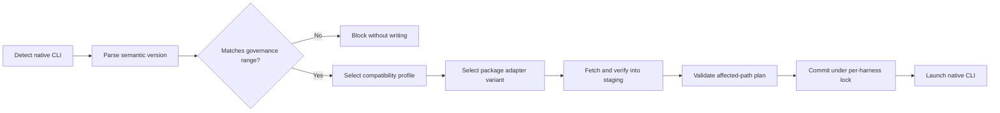

Blue does not bundle agent harnesses. It detects the native CLI already on `PATH`, reads its version, and selects a compiled compatibility profile before it writes managed files or launches the process. When an installed version is incompatible, an interactive CLI can offer to run the catalog-defined vendor installer after explicit confirmation.

## Reconciliation flow



The selected profile owns the native representation of managed settings, MCP servers, gateway wiring, session hooks, skills, subagents, plugins, helpers, environment variables, and launch arguments. Governance and packages remain declarative inputs.

## Pin an allowed range

Set `version_requirement` under the harness policy. Blue uses semantic-version requirement syntax.

```yaml
minimum_client_version: "0.1.0"
contract_version: 2
required_capabilities: [adapter_intervals, compiled_harness_registry, transactional_reconcile, versioned_state]
harnesses:
  codex:
    version_requirement: ">=0.149.0, <0.150.0"
    managed_config:
      model: gpt-5.6-sol
```

An exact pin uses `=0.149.1`. Omitting the field allows any installed version covered by a maintained client profile. The Control API records `minimum_client_version` for rollout visibility and requires the corresponding capabilities, which prevent an older Blue client from silently ignoring the constraint.

Every profile also has an exclusive certified release ceiling. A release tested through `0.151.0` uses `0.151.1-0` as its ceiling so prereleases of the next patch are blocked too. Blue blocks a newer release until that release is exercised and the ceiling advances. To deliberately accept a newer, untested release, constrain it explicitly and opt in:

```yaml
required_capabilities:
  - adapter_intervals
  - compiled_harness_registry
  - transactional_reconcile
  - unverified_harness_versions
  - versioned_state
harnesses:
  codex:
    version_requirement: ">=0.151.1, <0.152.0"
    allow_unverified_versions: true
```

The opt-in is rejected without `version_requirement`. Reconciliation and inventory continue with a warning because vendor changes beyond the certified ceiling may produce invalid configuration.

<Warning>
  A missing, unparsable, or policy-incompatible native harness version fails closed. Blue preserves the last managed state but does not rewrite files or launch that harness with a guessed format.
</Warning>

Run `blue apply` or launch through `blue run` to see the normalized version, selected profile, and compatibility error. Blue performs compatibility preflight only for the default or explicitly launched harness before changing its files.

## Repair an incompatible installation

In a terminal, `blue run` and `blue apply` show the policy-compatible install command and ask whether to run it. The default answer is **No**. If approved, Blue resolves a published release inside the policy and certified range, updates the installation that owns the detected executable, and verifies that same path against the policy before reconciliation or launch continues. This prevents an npm repair from appearing successful while a standalone binary earlier on `PATH` remains unchanged.

For npm-owned binaries, Blue runs the package-manager selector directly.
OpenCode repairs through the detected executable's version-aware upgrade command.
Standalone Kimi installations use Kimi's checksum-verifying installer with an
exact version and the detected installation root. Installer failure or an
unchanged detected path stops the flow before any managed files are written.

Blue-launched sessions suppress each harness's native update check or automatic
updater so a repaired version remains inside the certified range on subsequent
launches. This is scoped to the managed launch: running the native harness
directly retains the user's normal update behavior, and an external package
manager can still replace the installed binary. The selected compatibility
version's atomic operation set owns this suppression, so a later harness version
can adopt a changed vendor control without altering older intervals.

Daemon runs, redirected/non-interactive commands, and `blue apply --yes` never install native CLIs. They fail closed and print the command for an operator to run explicitly.

## Breaking-version profiles

Each harness has an ordered registry of compiled profiles. Every profile has an inclusive `introduced` bound, an optional exclusive breaking-generation `before` bound, and a mandatory exclusive `verified_before` release ceiling. Dispatch may remain open-ended, but certified support never is: a parseable release at or beyond `verified_before` is blocked unless the organization uses the explicit unverified opt-in above.

For example, introducing a profile at `2.0.0` produces these paths:

| Installed version | Selected path |
| --- | --- |
| `<2.0.0` | Existing profile retained for older installations |
| `>=2.0.0` and below its certified ceiling | New breaking-generation profile |
| At or above the certified ceiling | Blocked, or warned with explicit policy opt-in |

Maintainers add the boundary and version specification together, retain the older specification and operation set, and add golden output tests at the versions immediately below and at the boundary. A profile may later be marked deprecated, which continues to work with a warning. Removing it is an explicit Blue release change.

## Versioned package layouts

A package's normal adapter fields are its fallback layout. Use `variants` only when the archive exposes different paths for different native harness versions.

Use adapter-level `introduced` and `before` bounds when the package itself is
available only for part of the harness's history. Blue rejects enabling the
package when the organization harness policy extends outside that availability
range, so administrators can either narrow the harness policy or disable the
package for that harness.

```yaml
adapters:
  codex:
    introduced: 1.0.0
    before: 3.0.0
    variants:
      - introduced: 1.0.0
        before: 2.0.0
        skills_dir: toolkit/codex-v1
      - introduced: 2.0.0
        before: 3.0.0
        plugin_dir: toolkit/codex-v2
```

Adapter availability and variant intervals are inclusive at `introduced` and exclusive at `before`. Variants must stay inside adapter availability, be ordered, and not overlap. Gaps inside availability are allowed only when the adapter has a fallback layout.

## Transaction and rollback guarantees

Blue resolves every harness generation and constructs exact file bodies, modes, removals, environment variables, and launch arguments in memory before active files change. It then validates the plan, snapshots affected paths, and commits under per-harness advisory locks. Package and compatibility state are committed in the same transaction. A failed renderer, package activation, or state commit restores the snapshot; if a later required harness fails, the outer revision transaction restores earlier harness commits too.

If package selection, validation, download, helper collision, or installation fails, the whole previous package activation remains recorded. Blue activates that last-known-good content only when the stored adapter interval still contains the installed native harness version. Otherwise it retains the content inactive and blocks launch. Obsolete paths are removed only after a successful commit and only when the ownership manifest identifies them as Blue-owned.

Package and compatibility state files include schema versions. Unknown future schemas fail closed.

## Maintainer checklist

To add a generation for an existing harness:

1. Add a complete `VersionSpec` that reuses the harness family's operation set for unchanged behavior and explicitly marks optional capabilities supported or unsupported.
2. Register its contiguous `[introduced, before)` interval and an exclusive `verified_before` ceiling in order.
3. Add vendor version-output fixtures and golden output immediately below and at the boundary.
4. Advance the current certified ceiling when the E2E harness lock is updated; registry tests require a `next-patch-0` ceiling immediately beyond that pinned stable release.

If paths, rendering, inspection, package placement, gateway wiring, transcript discovery, installation, or launch behavior changes, add a named atomic operation set in the family module and select it from the new spec. Rust uses this composition in place of class inheritance: shipped specs remain immutable, and a new version can replace behavior without copying the whole adapter.

To add a harness, add one `gh_common::harness_catalog!` entry and its initial `adapters/<harness>/` family implementation and version spec. The catalog generates harness identity, enumeration, discovery metadata, and the `gh-config` definition registration. Production API schemas accept catalog keys rather than repeating a closed enum; docs and E2E matrices remain explicit evidence. To support a breaking vendor version, add one specification and one contiguous interval registration. Registry tests enforce unique keys and aliases, valid ordered probes, ordered lifecycle metadata, certified ceilings, and exactly one implementation per interval. Deprecate an interval by changing its lifecycle to `deprecated`; remove it only in an announced client release after policies and package intervals no longer target it. The complete file-level workflow is in [Harness adapter architecture](/next/development/harness-adapter-architecture).

Package variants select verified archive content only. They cannot send executable translation logic from the server: the selected compiled compatibility profile still decides how to load every component.

## Profile transition cleanup

Blue records the selected profile, normalized version, and generated paths in harness-owned compatibility state. When the selected profile changes, Blue writes the new overlay first and removes stale files only when they were recorded previously and remain inside Blue-owned runtime locations. Native user configuration and untracked files are never cleanup targets.

See [Governance configuration](/next/reference/governance-config) for the complete schema and [Troubleshooting](/next/cli/troubleshooting) for reconciliation diagnostics.
